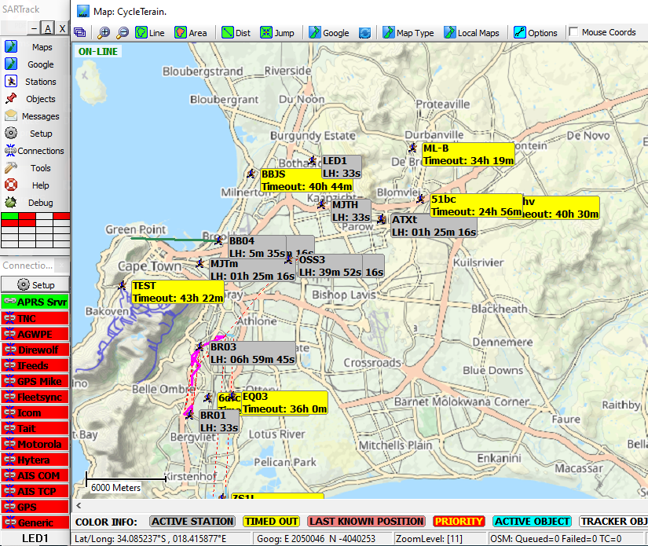

# Meshtastic-to-APRS-IS
 
**Important:** Since this may be dealing with call signs of non-radio amateurs, as standalone APRS-IS should be run with no connection to the wider APRS network.

This script will pull the Meshtastic node DB from a local node and upload position info to an APRS-IS server so that applications such as SARTrack or Xastir can be used for tracking.

## Setup

### Requirements

- Python 3.x
- Meshtastic
- pytz

### Installation
1. Clone the repository:
   
   ```sh
   cd ~
   git clone https://github.com/crackedatom/Meshtastic-to-APRS-IS.git
   cd Meshtastic-to-APRS-IS
   ```

2. Set up a Python virtual environment:  
   
   ```sh
   python -m venv venv
   ```

3. Activate the virtual environment:  
   
   - On Windows:  
   
   ```sh
   venv\Scripts\activate  
   ```
   
   - On macOS and Linux:
   
   ```sh
   source venv/bin/activate
   ```

4. Install the required packages:  
   
   ```sh
   pip install -r requirements.txt
   ```

5. Update the config.ini file to reflect your setup.

## Usage


Run the script with:

```sh
python meshaprsis.py
```

